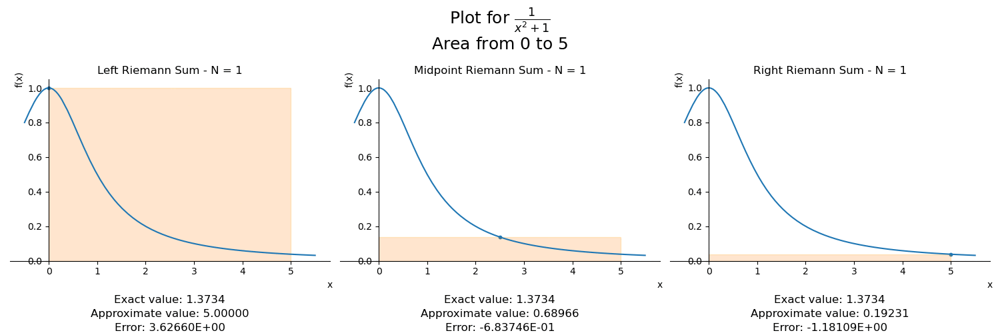

# Integrals

[](https://www.linkedin.com/in/flsbustamante/) 
[](https://www.python.org/) 
[](https://github.com/chicolucio/integrals/issues)



A Python script to compute integrals:

- symbolically with SymPy
- numerically through Riemann sums

Yes, you can make such calculations with SciPy. The project aims to be
educational, showing how numerical integration works through animations like the
one at the beginning. There are more animations in the [images folder](images/).

## Usage

1. clone the repo, not a package yet :-(
2. create a virtual environment with Python 3.8+
3. activate the virtual environment
4. install dependencies
5. run the scripts

```bash
git clone https://github.com/chicolucio/integrals
cd integrals
python -m venv .venv
source .venv/bin/activate
pip install -r requirements.txt
python animation.py
python integral.py
python antiderivatives.py
```

`animation.py` shows how more Riemann rectangles make the approximation better.
`integral.py` has examples of how to use the other methods. Both files have
more examples that can be uncommented in the code as instructed in them.
`antiderivatives.py` just plots a family of functions that are antiderivatives
of *2x*.

## Testing

Tests can be run in the top-level directory with the command `pytest -v tests/`.

## Contributing

All contributions are welcome.

**Issues**

Feel free to submit issues regarding:

- recommendations
- more animations or examples
- enhancement requests and new useful features
- code bugs

There are some open issues waiting for your help, see
[here](https://github.com/chicolucio/integrals/issues).

**Pull requests**

- before starting to work on your pull request, please submit an issue first
- fork the repo
- clone the project to your own machine
- commit changes to your own branch
- push your work back up to your fork
- submit a pull request so that your changes can be reviewed

## License

MIT, see [LICENSE](LICENSE)

## Citing

If you use this project in a scientific publication or in classes, please consider citing as

F. L. S. Bustamante, Integrals, 2022 - Available at: https://github.com/chicolucio/integrals

## More

- [LinkedIn](https://www.linkedin.com/in/flsbustamante/)
- [Portfolio](https://franciscobustamante.com.br/portfolio)
- [Curriculum Vitae](https://franciscobustamante.com.br/about/)
